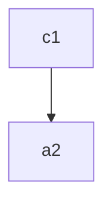

# VS Code

## Shorcuts 


1. mover lineas alt + arriba o abajo 
2. copiar lienas alt+shitf + arriba 
3. multiples cursores ctrl+alt+ hacia arriba o abajooo 


## Codigos 
```python
def test():
    print("hola")
```

```javascript
int a=10;
console.log(a);
```
### mermaid 

